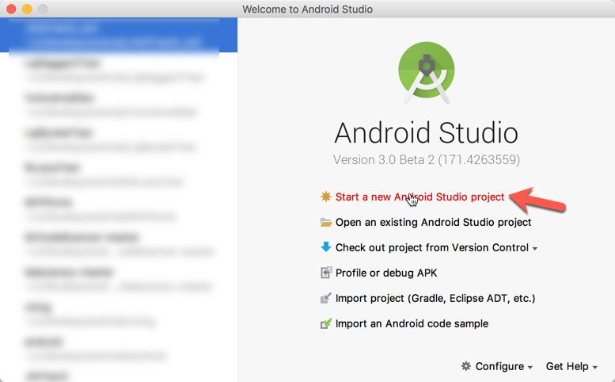
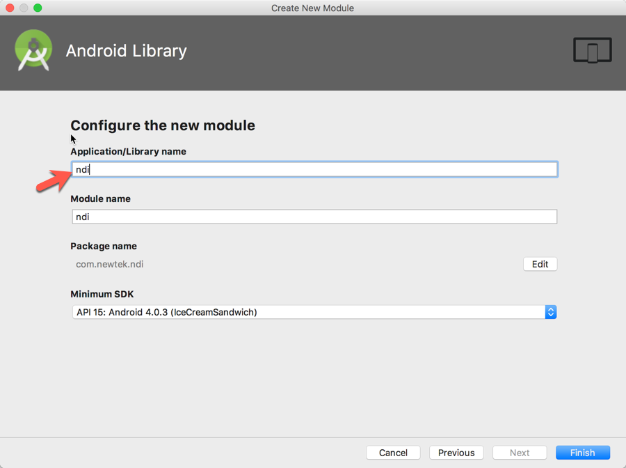

# How to build a .so file that Android can use

With Android Studio, a .so file can be built. Follow below steps.   

Confirm the NDK was intstalled in your computer.

(Here I use Android Studio 3.0 Beta 2 to illustrate it.)

## Create a project   
1. Launch Android Studio, create a new project

    

2. Change the `Application name` and `Company domain` as you need, select `Include C++ support` option.

    

3. Leave these pages as they are and click Next only:   
    
    
    

4. `C++ Standard`, select `C++11`, check `Exceptions Support(-fexceptions)` and `Runtime Type Information Support(-frtti)`   
    
    Click `Finish`. A project with an app module was created.

## Create lib module   
   We'll create a lib module to product ndi library(*.so files) which will be used by Android app.

1. `File` -> `New Module...`
    
2. Select `Android Library`      
    
3. Change the `Application/Library name` to `ndi`
    
    Click `Finish`, `ndi` module was created.

## Add C++ support for ndi lib module
1. Copy `CMakeLists.txt` from `app` directory to `ndi`    
    

2. Create a `cpp` directory under `ndi/src/main`:   
    

3. Now you can copy ndi c/c++ source and header files into `ndi/src/main/cpp/` directory. For illustration purpose, I create a `Processing.NDI.Lib.h` and a `Processing.NDI.Init.cpp` file into it.   
    

4. In `Processing.NDI.Lib.h`, declare a function named `bool NDIlib_initialize()`   

   ```
   #ifndef NDIDEMO_PROCESSING_NDI_LIB_H
   #define NDIDEMO_PROCESSING_NDI_LIB_H
   
   bool NDIlib_initialize();
   
   #endif //NDIDEMO_PROCESSING_NDI_LIB_H

   ```

5. In `Processing.NDI.Init.cpp`, implement the function:    

   ```
   #include <stdio.h>

   bool NDIlib_initialize(){
       printf("initialize success");
       return true;
   }

   ```
6. Modify the `ndi/CMakeLists.txt`:   
    

7. Modify the `ndi/build.gradle`:   
    

8. Click `Sync now`.    
    

## Build ndi module
1. `Build` -> `Make Module 'ndi'`  
    

2. Then you will see the built .so files(here is debug version):
    

    **Thus, the process of .so files built for Android is finished.**

    Next, we'll illustrate how to use it in an Android App.

## Use so files in Android app   

   Now we can use the libndi.so files in an Android App. Here I illustrate within the exist `app` module.

1. Create a `ndi` library under `ndidemo/app`, in `ndi` directory, create `include` and `lib` sub-directories.

2. Copy `ndidemo/ndi/src/main/cpp/Processing.NDI.Lib.h` into `ndidemo/app/include/`, and `ndidemo/ndi/build/intermediates/cmake/debug/obj/*` into `ndidemo/app/lib/`:
    

3. In the `app/build.gradle`: 
    
        
4. In the `app/CMakeLists.txt`:    
    

5. Click `Sync Now` on the top-right of the document.    

6. Test `NDIlib_initialize function`:   
   
   In `MainActivity.kt`, declare a function:  

    

7. Make `jni` directory under `ndidemo/app/src/main/`, create a `MainActivity.h` file, declare function:

    ```
    /* DO NOT EDIT THIS FILE - it is machine generated */
    #include <jni.h>
    /* Header for class com_newtek_ndidemo_MainActivity */

    #ifndef _Included_com_newtek_ndidemo_MainActivity
    #define _Included_com_newtek_ndidemo_MainActivity
    #ifdef __cplusplus
    extern "C" {
    #endif
    /*
    * Class:     com_newtek_ndidemo_MainActivity
    * Method:    testNDIInitialize
    * Signature: ()Z
    */
    JNIEXPORT jboolean JNICALL Java_com_newtek_ndidemo_MainActivity_testNDIInitialize
    (JNIEnv *, jobject);

    #ifdef __cplusplus
    }
    #endif
    #endif

    ```

8. In the `native-lib.cpp`, implement the function:

    ```
    #include "Processing.NDI.Lib.h"
    #include "MainActivity.h"
    ...

    JNIEXPORT jboolean JNICALL Java_com_newtek_ndidemo_MainActivity_testNDIInitialize
            (JNIEnv *env, jobject){
        bool success = NDIlib_initialize();

        return (jboolean)success;
    }
    ```

 9. Test the function. In MainActivity.kt:   
    ```
    val success = testNDIInitialize()
    Log.i("MainActivity", "$success")

    ```

    

 10. Build and run the app, you will see the log.   
   


